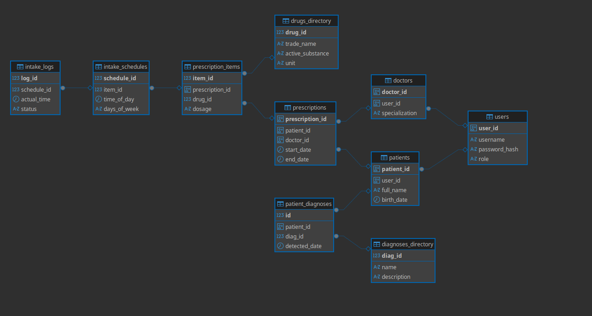
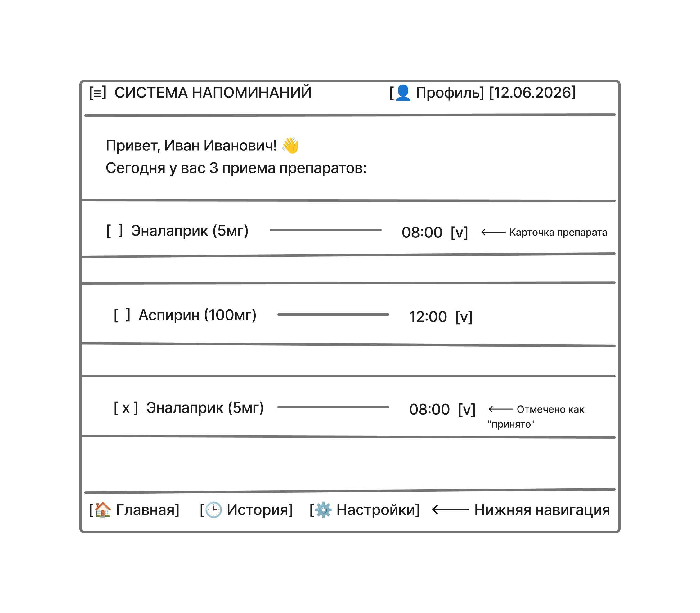
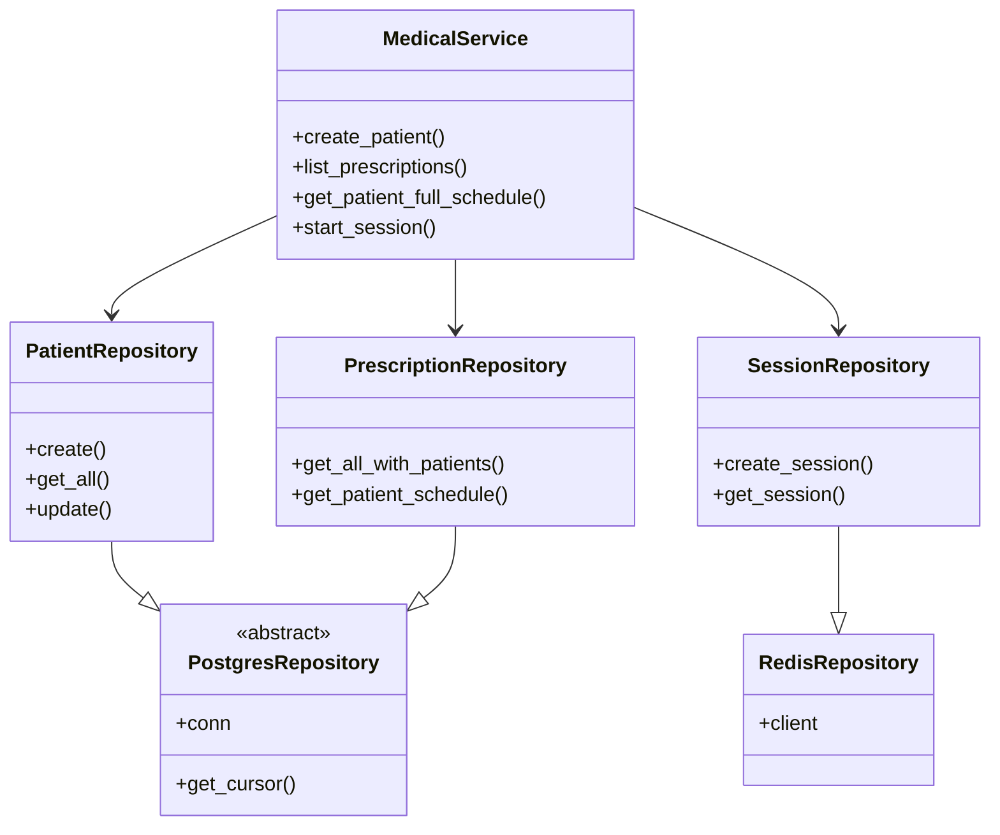

# Контрольная работа: Информационная система «Медицинские напоминания»

## 1. Анализ предметной области
**Описание предметной области:**
Данная система предназначена для автоматизации процесса контроля приема лекарственных препаратов пациентами с хроническими заболеваниями. Основная проблема, которую решает система — низкая приверженность лечению из-за сложности графиков приема и человеческого фактора (забывчивость).

**Выполняемые программой функции:**
- **Хранение и управление данными:** Ведение реестров пациентов, врачей, справочников препаратов и диагнозов.
- **Назначение лечения:** Создание врачом индивидуальных курсов лечения с указанием дозировок и сроков.
- **Планирование приема:** Формирование детального графика (время суток, дни недели) для каждого препарата.
- **Мониторинг и уведомления:** Генерация напоминаний о приеме и фиксация факта принятия препарата пользователем.

**Нефункциональные требования:**
- **Надежность:** Обеспечение целостности медицинских данных (ACID в PostgreSQL).
- **Производительность:** Высокая скорость доступа к текущему расписанию и управлению сессиями (использование Redis).
- **Безопасность:** Разграничение прав доступа между Администратором, Врачом и Пациентом.

## 2. Концептуальная модель БД и ER-диаграмма
Система базируется на подходе **Polyglot Persistence**, используя две разные СУБД для разных типов данных.

### Реляционная БД (PostgreSQL)
Используется для хранения структурированных данных с жесткими связями.
- **Сущности:** Пользователи, Пациенты, Врачи, Справочники диагнозов и лекарств, Назначения, Графики приема, Логи приемов.
- **Связи:** Один-ко-многим (Один врач $\to$ много назначений; один пациент $\to$ много назначений).

### NoSQL БД (Redis)
Используется как высокопроизводительный слой для оперативных данных.
- **Типы данных:** 
    - `Strings`: Для хранения токенов активных сессий пользователей.
    - `Hashes`: Для быстрого кэширования справочной информации о препаратах.
    - `Lists`: Для реализации очереди уведомлений.

## 3. Логическая схема БД
База данных спроектирована с соблюдением 3-й нормальной формы. Основные ограничения включают:
- `PRIMARY KEY` для каждой таблицы (UUID для обеспечения уникальности в распределенных системах).
- `FOREIGN KEY` для обеспечения ссылочной целостности (например, назначение не может существовать без пациента и врача).
- `CHECK` ограничения для ролей пользователей и статусов приемов.

**(Подробная схема таблиц представлена в приложениях к отчету / Lab 1)**

## 4. Расширенные возможности реляционной СУБД
В рамках реализации были применены следующие инструменты оптимизации PostgreSQL:
- **Индексация:** Созданы B-tree индексы для часто запрашиваемых полей (ФИО пациентов, названия препаратов), что позволило существенно сократить время выполнения поисковых запросов.
- **Программируемость (PL/pgSQL):** Реализованы хранимые функции и процедуры для автоматизации бизнес-логики, такие как расчет следующего времени приема препарата.
- **Представления (Views):** Созданы сложные представления для быстрого получения «Дневного расписания» и «Нагрузки врачей».

## 5. Реализация и наполнение БД
БД развернуты с помощью Docker Compose. Наполнение данными осуществлялось двумя способами:
1. **SQL-скрипты:** Первичная инициализация структуры и базовых справочников (`init_db.sql`).
2. **Python-генератор:** Автоматическое создание набора из 60+ записей для каждой таблицы для имитации реальной нагрузки и тестирования производительности.

## 6. Операции с базами данных
### PostgreSQL
Реализован полный цикл CRUD:
- **Добавление:** Создание новых пациентов и назначений.
- **Редактирование:** Обновление дозировок и дат курса.
- **Удаление:** Отмена назначений.
- **Сложные выборки:** Использование `JOIN` для объединения данных о пациентах, препаратах и графиках.

### Redis
- **Управление сессиями:** `SET session:token user_id EX 3600` $\to$ `GET session:token`.
- **Кэширование:** Использование `HSET` и `HGETALL` для быстрого доступа к данным о лекарствах.
- **Очереди:** `LPUSH` и `RPOP` для управления потоком уведомлений.

## 7. Интерфейс информационной системы
Для системы реализован консольный интерфейс (CLI), обеспечивающий доступ ко всем функциям управления.

**Проектирование интерфейса (Макеты):**

*Интерфейс главного экрана пациента с текущим расписанием приема препаратов:*

*Интерфейс кабинета врача для создания и редактирования медицинских назначений:*

*Интерфейс администратора для управления справочниками лекарств и диагнозов:*

**Реализованный интерфейс приложения:**
*Главное меню управления системой:*

## 8. Архитектура программы
Приложение построено на принципах многослойной архитектуры и ООП.

### Схема архитектуры:
`UI Layer (main.py)` $\to$ `Service Layer (medical_service.py)` $\to$ `Repository Layer (repositories.py)` $\to$ `Database (PostgreSQL/Redis)`

### Диаграмма классов (High-level):

### Алгоритм получения расписания:
1. Пользователь вводит `patient_id`.
2. `MedicalService` запрашивает данные у `PrescriptionRepository`.
3. Выполняется SQL-запрос с `JOIN` четырех таблиц: `patients` $\to$ `prescriptions` $\to$ `prescription_items` $\to$ `drugs_directory` $\to$ `intake_schedules`.
4. Результат возвращается в UI в виде списка препаратов с временем приема.

## 9. Программная реализация
- **Язык:** Python 3.11.
- **Библиотеки:** `psycopg2-binary` (PG), `redis` (NoSQL).
- **Реализация функционала:**
    - Реализован полный CRUD для основных сущностей.
    - Интегрированы сложные JOIN-запросы для вывода атрибутов вместо ID.
    - Внедрена поддержка сессий и кэширования через Redis.

**Демонстрация работы (скриншоты):**
- **CRUD и JOIN:** 
- **NoSQL функции:** 
- **Функциональный отчет:** 

## 10. Состав проекта
Итоговый пакет содержит:
- **Исходный код:** Все файлы из директории `/src` (Python).
- **Базы данных:** Скрипты инициализации (`init_db.sql`) и наполнения (`seed_data.sql`, `seed_redis.sh`).
- **Документация:** Данный отчет.
- **Репозиторий:** [https://github.com/Ramzikkkk/medical-reminders-db.git](https://github.com/Ramzikkkk/medical-reminders-db.git)
