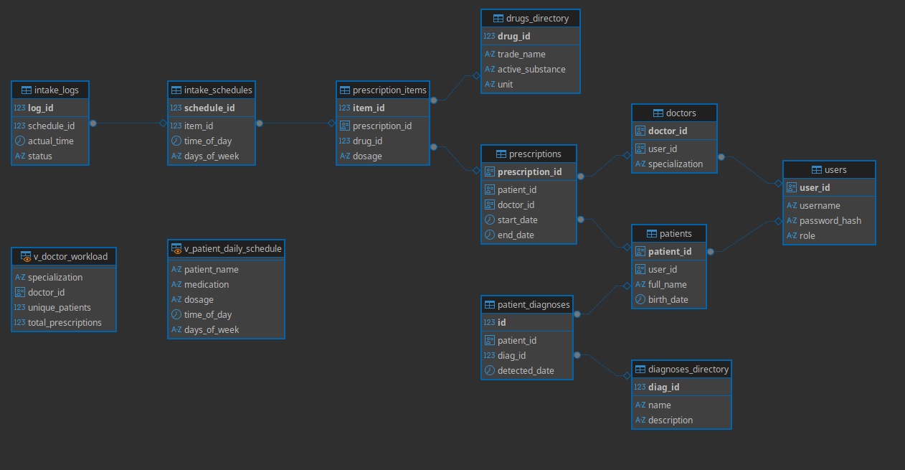
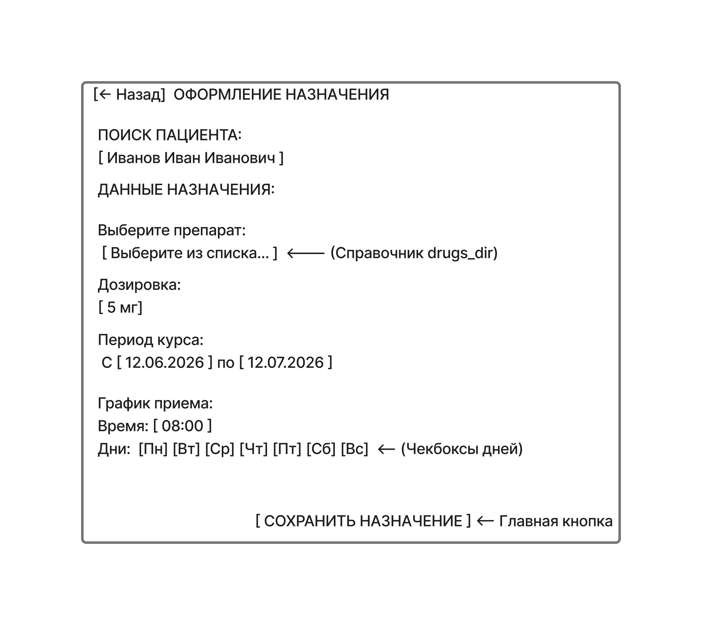
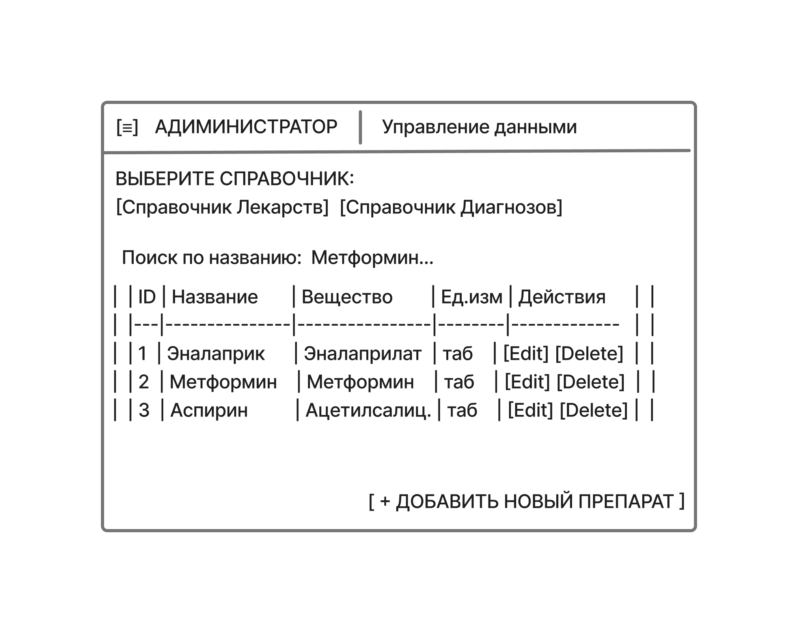

# Отчет по Лабораторной работе №1
**Предмет:** Базы данных
**Проект:** Система напоминаний о приеме медицинских препаратов

## 1. Анализ предметной области
**Проблема:** Пациенты с хроническими заболеваниями или сложным графиком лечения часто забывают принять препарат или путают дозировку, что приводит к снижению эффективности терапии или возникновению побочных эффектов.

**Решение:** Разработка программного комплекса, который позволяет врачу назначать препараты, а пациенту — получать автоматические уведомления о необходимости приема согласно строгому графику.

## 2. Описание системы и пользователей
Система представляет собой сервис управления медицинскими назначениями.

**Пользователи:**
- **Пациент:** Основной пользователь. Просматривает свои назначения, отмечает факт приема препарата, настраивает уведомления.
- **Врач:** Создает назначения, привязывает препараты к диагнозам пациента, корректирует график приема.
- **Администратор:** Управляет справочниками диагнозов и лекарственных средств, контролирует доступ к системе.

## 3. Функциональные требования
1. **Управление пользователями:** Регистрация, аутентификация и разграничение прав доступа.
2. **Ведение медицинских карт:** Привязка диагнозов к конкретному пациенту.
3. **Назначение лечения:** Создание перечня препаратов с указанием дозировки и длительности курса.
4. **Планирование приема:** Формирование детального расписания (время суток, дни недели).
5. **Система уведомлений:** Автоматическая генерация напоминаний в установленное время.
6. **Трекинг приемов:** Фиксация факта приема препарата пользователем (для контроля приверженности лечению).
7. **Справочная информация:** Поиск по справочнику диагнозов и лекарств.

## 4. Описание хранимых данных (Реляционная БД)
Для системы выбрана реляционная модель данных. Ниже представлены 10 основных сущностей.

**Схема данных:** Реляционная схема была разработана и верифицирована с помощью инструмента DBeaver. Сгенерированный визуальный граф зависимостей (ER-диаграмма) представлен ниже:



### Схема таблиц (PostgreSQL)
1. **users** (Пользователи)
   - `user_id` (UUID, PK): Уникальный идентификатор.
   - `username` (VARCHAR): Логин.
   - `password_hash` (TEXT): Хеш пароля.
   - `role` (VARCHAR): Роль (Patient, Doctor, Admin).

2. **patients** (Пациенты)
   - `patient_id` (UUID, PK): Идентификатор.
   - `user_id` (UUID, FK $\to$ users): Связь с аккаунтом.
   - `full_name` (VARCHAR): ФИО.
   - `birth_date` (DATE): Дата рождения.

3. **doctors** (Врачи)
   - `doctor_id` (UUID, PK): Идентификатор.
   - `user_id` (UUID, FK $\to$ users): Связь с аккаунтом.
   - `specialization` (VARCHAR): Специализация.

4. **diagnoses_directory** (Справочник диагнозов)
   - `diag_id` (SERIAL, PK): ID диагноза.
   - `name` (VARCHAR): Название заболевания.
   - `description` (TEXT): Описание.

5. **patient_diagnoses** (Диагнозы пациента)
   - `id` (SERIAL, PK): ID записи.
   - `patient_id` (UUID, FK $\to$ patients): Кто болен.
   - `diag_id` (INT, FK $\to$ diagnoses_directory): Чем болен.
   - `detected_date` (DATE): Дата постановки диагноза.

6. **drugs_directory** (Справочник препаратов)
   - `drug_id` (SERIAL, PK): ID препарата.
   - `trade_name` (VARCHAR): Торговое название.
   - `active_substance` (VARCHAR): Действующее вещество.
   - `unit` (VARCHAR): Единица измерения (таб, мл, капс).

7. **prescriptions** (Назначения)
   - `prescription_id` (UUID, PK): ID назначения.
   - `patient_id` (UUID, FK $\to$ patients): Для кого.
   - `doctor_id` (UUID, FK $\to$ doctors): Кто назначил.
   - `start_date` (DATE): Дата начала курса.
   - `end_date` (DATE): Дата окончания курса.

8. **prescription_items** (Состав назначения)
   - `item_id` (SERIAL, PK): ID позиции.
   - `prescription_id` (UUID, FK $\to$ prescriptions): К какому назначению относится.
   - `drug_id` (INT, FK $\to$ drugs_directory): Какой препарат.
   - `dosage` (VARCHAR): Дозировка (например, "500мг").

9. **intake_schedules** (График приема)
   - `schedule_id` (SERIAL, PK): ID правила.
   - `item_id` (INT, FK $\to$ prescription_items): Что принимать.
   - `time_of_day` (TIME): Время приема.
   - `days_of_week` (VARCHAR): Дни недели (например, "Mon,Wed,Fri").

10. **intake_logs** (Логи приемов - *позже будет перенесено в ClickHouse*)
    - `log_id` (BIGSERIAL, PK): ID записи.
    - `schedule_id` (INT, FK $\to$ intake_schedules): Какое правило сработало.
    - `actual_time` (TIMESTAMP): Когда фактически принято.
    - `status` (VARCHAR): Статус (Taken, Skipped).

## 5. Основные операции с БД
- **Добавление:** Создание нового пациента, добавление препарата в справочник, назначение курса лечения.
- **Редактирование:** Изменение дозировки препарата в активном назначении, обновление контактных данных пациента.
- **Удаление:** Отмена назначения (soft delete), удаление ошибочно введенного препарата из справочника.
- **Чтение:** Получение списка всех приемов на сегодня для конкретного пациента.

## 6. Макеты интерфейса (Спецификация)

Разработка макетов была осуществлена в соответствии со следующими требованиями к экранам:

1. **Дашборд Пациента (Главный экран):**
   - **Верхняя панель:** Имя пациента, дата, кнопка "Профиль".
   - **Центральная область:** Список препаратов, которые необходимо принять сегодня. Каждая карточка содержит: название препарата, дозировку, время приема и чекбокс "Принял".
   - **Нижняя панель:** Навигация (Дом, История, Настройки).

   

2. **Кабинет Врача (Экран назначения):**
   - **Поиск:** Поле ввода для поиска пациента по ФИО.
   - **Форма назначения:** 
     - Выпадающий список препаратов (из справочника `drugs_directory`).
     - Поле ввода дозировки.
     - Календарь выбора даты начала и окончания курса.
     - Сетка выбора дней недели и времени приема.
   - **Кнопка:** "Сохранить назначение".

   

3. **Админ-панель (Управление справочниками):**
   - **Таблицы:** Отображение списков всех диагнозов и лекарственных средств.
   - **Функционал:** Кнопки "Добавить запись", "Редактировать", "Удалить" для каждой строки.
   - **Фильтрация:** Поиск по названию или действующему веществу.

   

## 7. Выбор СУБД
- **Реляционная БД:** PostgreSQL (обеспечивает ACID, поддержку сложных связей и строгую типизацию).
- **NoSQL БД:** ClickHouse (используется для аналитики приверженности лечению: хранение миллионов записей о приемах с высокой скоростью сжатия и агрегации).

## 8. Графическая оболочка
- **DBeaver:** Выбран как универсальный инструмент для работы с обеими СУБД (PostgreSQL и ClickHouse).

## 9. Установка и проверка
Для развертывания базы данных был разработан Bash-скрипт `setup_db.sh`, который автоматизирует следующие шаги:
1. Создание базы данных `medical_reminders`.
2. Применение SQL-схемы из файла `init_db.sql` (создание таблиц, ключей и ограничений).
3. Наполнение базы тестовыми данными с помощью `seed_data.sql`.

Все функции создания таблиц и связей были проверены через DBeaver; целостность данных подтверждена успешным выполнением скриптов инициализации.

## 10-12. SQL-код создания БД
```sql
CREATE EXTENSION IF NOT EXISTS "uuid-ossp";

CREATE TABLE users (
    user_id UUID PRIMARY KEY DEFAULT uuid_generate_v4(),
    username VARCHAR(50) UNIQUE NOT NULL,
    password_hash TEXT NOT NULL,
    role VARCHAR(20) CHECK (role IN ('Patient', 'Doctor', 'Admin'))
);

CREATE TABLE patients (
    patient_id UUID PRIMARY KEY DEFAULT uuid_generate_v4(),
    user_id UUID UNIQUE REFERENCES users(user_id),
    full_name VARCHAR(255) NOT NULL,
    birth_date DATE
);

CREATE TABLE doctors (
    doctor_id UUID PRIMARY KEY DEFAULT uuid_generate_v4(),
    user_id UUID UNIQUE REFERENCES users(user_id),
    specialization VARCHAR(100)
);

CREATE TABLE diagnoses_directory (
    diag_id SERIAL PRIMARY KEY,
    name VARCHAR(255) NOT NULL,
    description TEXT
);

CREATE TABLE patient_diagnoses (
    id SERIAL PRIMARY KEY,
    patient_id UUID REFERENCES patients(patient_id),
    diag_id INT REFERENCES diagnoses_directory(diag_id),
    detected_date DATE
);

CREATE TABLE drugs_directory (
    drug_id SERIAL PRIMARY KEY,
    trade_name VARCHAR(255) NOT NULL,
    active_substance VARCHAR(255),
    unit VARCHAR(50)
);

CREATE TABLE prescriptions (
    prescription_id UUID PRIMARY KEY DEFAULT uuid_generate_v4(),
    patient_id UUID REFERENCES patients(patient_id),
    doctor_id UUID REFERENCES doctors(doctor_id),
    start_date DATE NOT NULL,
    end_date DATE
);

CREATE TABLE prescription_items (
    item_id SERIAL PRIMARY KEY,
    prescription_id UUID REFERENCES prescriptions(prescription_id),
    drug_id INT REFERENCES drugs_directory(drug_id),
    dosage VARCHAR(50)
);

CREATE TABLE intake_schedules (
    schedule_id SERIAL PRIMARY KEY,
    item_id INT REFERENCES prescription_items(item_id),
    time_of_day TIME NOT NULL,
    days_of_week VARCHAR(100)
);

CREATE TABLE intake_logs (
    log_id BIGSERIAL PRIMARY KEY,
    schedule_id INT REFERENCES intake_schedules(schedule_id),
    actual_time TIMESTAMP DEFAULT CURRENT_TIMESTAMP,
    status VARCHAR(20) CHECK (status IN ('Taken', 'Skipped'))
);