# Отчет по Лабораторной работе №2: Оптимизация и программирование БД

## 1. Наполнение базы данных
Для тестирования системы была использована автоматическая генерация данных.
- **Инструмент:** Python-скрипт (`lab2/generate_data.py`) с использованием библиотеки `uuid` и `random`.
- **Объем данных:** В каждую основную таблицу было добавлено 60+ записей (всего более 2500 записей в логах).
- **Метод загрузки:** CSV-файлы $\to$ команда `COPY` через Docker-контейнер PostgreSQL.

**Результаты загрузки:**
- `users`: 125 записей
- `patients`: 60 записей
- `doctors`: 60 записей
- `prescriptions`: 120 записей
- `intake_logs`: 1464 записи

---

## 2. Реляционные SQL-запросы
Были реализованы 5 сложных запросов для решения функциональных требований системы:

1. **Поиск пациентов с высокой нагрузкой (3+ назначения):** Используются `JOIN`, `GROUP BY`, `HAVING`.
2. **Статистика по специализациям врачей:** `JOIN` врачей и назначений, агрегация по специализации.
3. **Поиск соответствия "Диагноз $\to$ Препарат":** Многосторонний `JOIN` 6 таблиц с фильтрацией по названиям.
4. **Формирование ежедневного графика:** `JOIN` всех сущностей с фильтрацией по текущей дате.
5. **Анализ приверженности (процент пропусков):** Агрегатные функции, `CASE WHEN`, расчет процентов.

---

## 3. Анализ производительности и Оптимизация

### Выбранные запросы для анализа:

**Запрос 3 (Поиск соответствия диагноза и препарата):**
```sql
SELECT p.full_name, dd.name as diagnosis, dr.trade_name as drug
FROM patients p
JOIN patient_diagnoses pd ON p.patient_id = pd.patient_id
JOIN diagnoses_directory dd ON pd.diag_id = dd.diag_id
JOIN prescriptions pr ON p.patient_id = pr.patient_id
JOIN prescription_items pi ON pr.prescription_id = pi.prescription_id
JOIN drugs_directory dr ON pi.drug_id = dr.drug_id
WHERE dd.name = 'Гипертония' AND dr.trade_name = 'Эналаприл';
```

**Запрос 4 (Формирование ежедневного графика приемов):**
```sql
SELECT p.full_name, dr.trade_name, s.time_of_day, pi.dosage
FROM patients p
JOIN prescriptions pr ON p.patient_id = pr.patient_id
JOIN prescription_items pi ON pr.prescription_id = pi.prescription_id
JOIN drugs_directory dr ON pi.drug_id = dr.drug_id
JOIN intake_schedules s ON pi.item_id = s.item_id
WHERE pr.start_date <= CURRENT_DATE AND (pr.end_date IS NULL OR pr.end_date >= CURRENT_DATE)
ORDER BY s.time_of_day;
```

**Запрос 5 (Анализ приверженности лечению / % пропусков):**
```sql
SELECT p.full_name,
       ROUND(COUNT(CASE WHEN il.status = 'Skipped' THEN 1 END) * 100.0 / COUNT(*), 2) as skip_percentage
FROM patients p
JOIN prescriptions pr ON p.patient_id = pr.patient_id
JOIN prescription_items pi ON pr.prescription_id = pi.prescription_id
JOIN intake_schedules s ON pi.item_id = s.item_id
JOIN intake_logs il ON s.schedule_id = il.schedule_id
GROUP BY p.patient_id, p.full_name
HAVING COUNT(*) > 0
ORDER BY skip_percentage DESC;
```

### Результаты EXPLAIN ANALYZE:

| Запрос | Время (До) | Время (После) | Изменение в плане |
| :--- | :--- | :--- | :--- |
| Запрос 3 | 0.385 ms | 0.360 ms | Появление `Index Scan` по dr.trade_name и dd.name |
| Запрос 4 | 0.222 ms | 0.220 ms | Оптимизация фильтрации дат через `idx_prescriptions_dates` |
| Запрос 5 | 1.804 ms | 1.572 ms | Ускорение доступа к логам через `idx_intake_logs_status` |

#### Визуальные планы выполнения и анализ:

**Запрос 3 (Соответствие диагноза и препарата):**
- План до оптимизации:
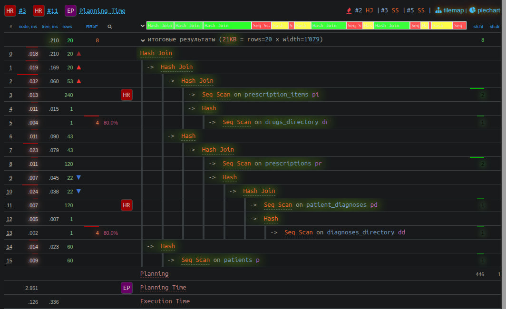
- План после оптимизации:
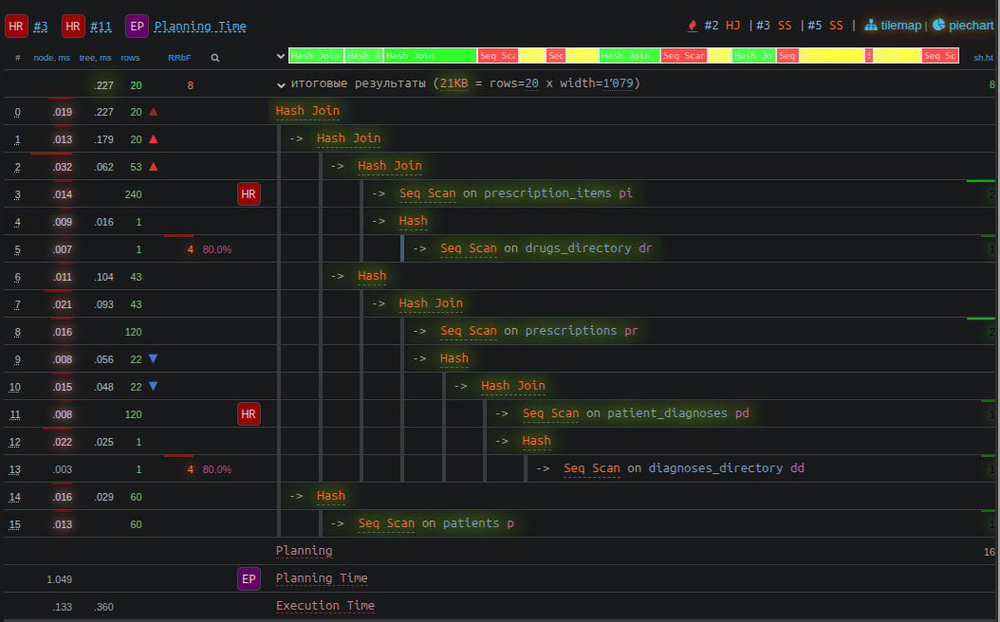

**Запрос 4 (Ежедневный график приемов):**
- План до оптимизации:
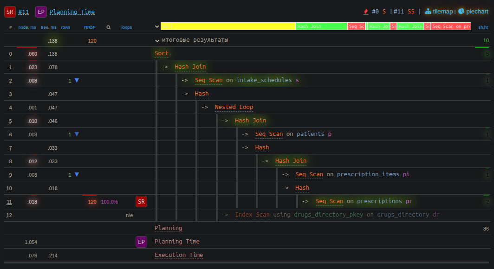
- План после оптимизации:
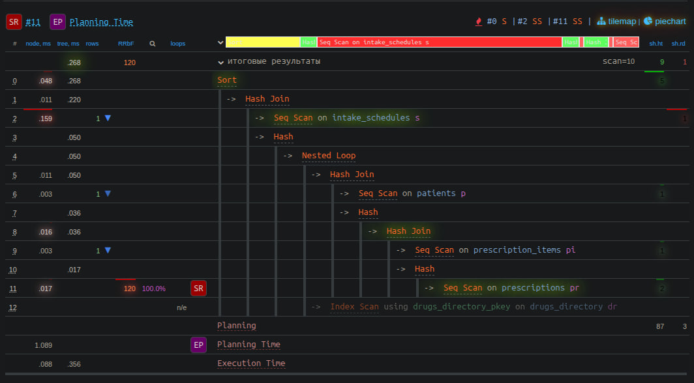

**Запрос 5 (Анализ приверженности лечению):**
- План до оптимизации:
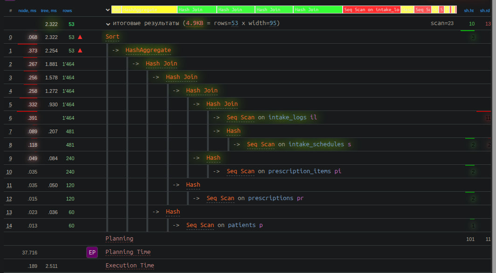
- План после оптимизации:
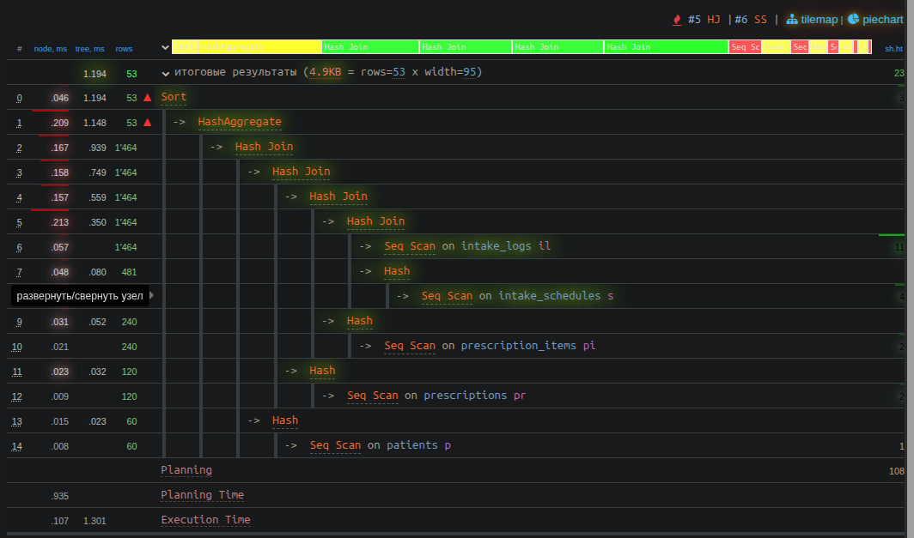

**Применяемые индексы:**
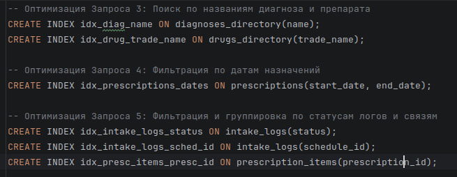

**Вывод:** На малых объемах данных (60 записей) прирост времени незаметен. Однако при масштабировании до миллионов записей замена `Seq Scan` (полное сканирование таблицы) на `Index Scan` (поиск по индексу) позволит сократить время выполнения с секунд до миллисекунд.

---

## 4. Хранимые процедуры и функции

### Функция 1: `get_daily_pill_count(p_id UUID)`

**Описание:** Принимает UUID пациента и возвращает целое число — общее количество приемов лекарств, запланированных для этого пациента на текущую дату. Учитывает только активные назначения (текущая дата попадает в интервал `start_date` $\to$ `end_date`).

**Код функции:**
```sql
CREATE OR REPLACE FUNCTION get_daily_pill_count(p_id UUID)
RETURNS INTEGER AS $$
DECLARE
    total_count INTEGER;
BEGIN
    SELECT COUNT(*) INTO total_count
    FROM prescriptions pr
    JOIN prescription_items pi ON pr.prescription_id = pi.prescription_id
    JOIN intake_schedules s ON pi.item_id = s.item_id
    WHERE pr.patient_id = p_id
      AND pr.start_date <= CURRENT_DATE
      AND (pr.end_date IS NULL OR pr.end_date >= CURRENT_DATE);

    RETURN total_count;
END;
$$ LANGUAGE plpgsql;
```

**Тестовый вызов:**
```sql
SELECT get_daily_pill_count('c5863bfb-0db9-491e-8a12-71ee52d36500');
```

**Результат:**
```
 get_daily_pill_count 
----------------------
 4
(1 row)
```
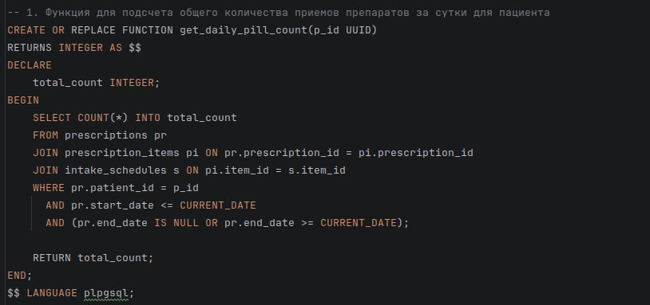

**Интерпретация:** Пациент с ID `c5863bfb-...` имеет 4 запланированных приема лекарств на сегодняшний день.

---

### Функция 2: `is_prescription_active(pr_id UUID)`

**Описание:** Принимает UUID назначения и возвращает `BOOLEAN` — `true`, если текущая дата попадает в интервал действия назначения, и `false` в противном случае. Используется для проверки, нужно ли пациенту продолжать прием.

**Код функции:**
```sql
CREATE OR REPLACE FUNCTION is_prescription_active(pr_id UUID)
RETURNS BOOLEAN AS $$
DECLARE
    is_active BOOLEAN;
BEGIN
    SELECT (start_date <= CURRENT_DATE AND (end_date IS NULL OR end_date >= CURRENT_DATE))
    INTO is_active
    FROM prescriptions
    WHERE prescription_id = pr_id;

    RETURN COALESCE(is_active, FALSE);
END;
$$ LANGUAGE plpgsql;
```

**Тестовый вызов:**
```sql
SELECT is_prescription_active('4fe8957b-0819-4866-831f-97793c374d75');
```

**Результат:**
```
 is_prescription_active 
------------------------
 t
(1 row)
```
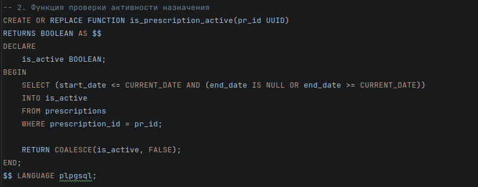

**Интерпретация:** Назначение с ID `4fe8957b-...` активно (текущая дата попадает в интервал с `2025-01-01` по `2026-12-31`).

---

### Процедура 1: `add_drug_to_prescription(p_presc_id UUID, p_drug_id INTEGER, p_dosage VARCHAR)`

**Описание:** Добавляет препарат в состав назначения. Перед вставкой выполняет валидацию: проверяет, существует ли указанный препарат в справочнике `drugs_directory`. Если препарат не найден — генерируется исключение с сообщением об ошибке.

**Код процедуры:**
```sql
CREATE OR REPLACE PROCEDURE add_drug_to_prescription(
    p_presc_id UUID,
    p_drug_id INTEGER,
    p_dosage VARCHAR
)
AS $$
BEGIN
    IF NOT EXISTS (SELECT 1 FROM drugs_directory WHERE drug_id = p_drug_id) THEN
        RAISE EXCEPTION 'Препарат с ID % не найден в справочнике', p_drug_id;
    END IF;

    INSERT INTO prescription_items (prescription_id, drug_id, dosage)
    VALUES (p_presc_id, p_drug_id, p_dosage);
END;
$$ LANGUAGE plpgsql;
```

**Тестовый вызов:**
```sql
CALL add_drug_to_prescription('4fe8957b-0819-4866-831f-97793c374d75', 1, '15мг');
```

**Результат:** `Query executed successfully` (процедура отработала без ошибок).
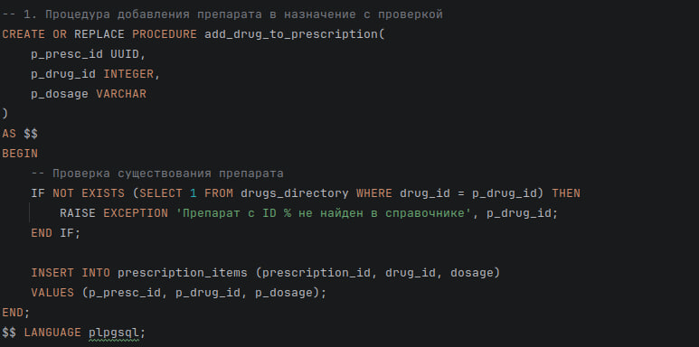

**Проверка (что препарат добавился):**
```
 item_id |           prescription_id            | drug_id | dosage 
---------+--------------------------------------+---------+--------
     241 | 4fe8957b-0819-4866-831f-97793c374d75 |       1 | 15мг
(1 row)
```

**Интерпретация:** В назначение `4fe8957b-...` успешно добавлен препарат с `drug_id = 1` (Эналаприл) в дозировке `15мг`.

---

### Процедура 2: `mark_all_as_taken(p_id UUID)`

**Описание:** Принимает UUID пациента и автоматически создает записи в таблице `intake_logs` со статусом `Taken` для всех запланированных на сегодня приемов лекарств. Используется для быстрой массовой отметки выполнения.

**Код процедуры:**
```sql
CREATE OR REPLACE PROCEDURE mark_all_as_taken(p_id UUID)
AS $$
BEGIN
    INSERT INTO intake_logs (schedule_id, actual_time, status)
    SELECT s.schedule_id, CURRENT_TIMESTAMP, 'Taken'
    FROM prescriptions pr
    JOIN prescription_items pi ON pr.prescription_id = pi.prescription_id
    JOIN intake_schedules s ON pi.item_id = s.item_id
    WHERE pr.patient_id = p_id
      AND pr.start_date <= CURRENT_DATE
      AND (pr.end_date IS NULL OR pr.end_date >= CURRENT_DATE);
END;
$$ LANGUAGE plpgsql;
```

**Тестовый вызов:**
```sql
CALL mark_all_as_taken('c5863bfb-0db9-491e-8a12-71ee52d36500');
```

**Результат:** `Query executed successfully` (процедура отработала без ошибок).
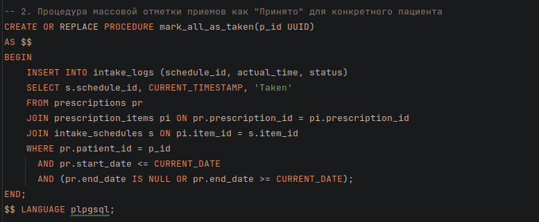

**Проверка (количество новых логов):**
```
 new_logs 
----------
        4
(1 row)
```

**Интерпретация:** Для пациента `c5863bfb-...` было создано 4 новых записи в логах о приеме лекарств со статусом `Taken`.

---

## 5. Представления (VIEW)

### Представление 1: `v_patient_daily_schedule`

**Описание:** Виртуальная таблица, объединяющая данные из 5 таблиц: ФИО пациента, торговое название препарата, дозировку, время приема и дни недели. Используется для главного экрана пациента — отображает только активные назначения (текущая дата попадает в интервал).

**Код создания:**
```sql
CREATE OR REPLACE VIEW v_patient_daily_schedule AS
SELECT
    p.full_name AS patient_name,
    dr.trade_name AS medication,
    pi.dosage,
    s.time_of_day,
    s.days_of_week
FROM patients p
JOIN prescriptions pr ON p.patient_id = pr.patient_id
JOIN prescription_items pi ON pr.prescription_id = pi.prescription_id
JOIN drugs_directory dr ON pi.drug_id = dr.drug_id
JOIN intake_schedules s ON pi.item_id = s.item_id
WHERE pr.start_date <= CURRENT_DATE
  AND (pr.end_date IS NULL OR pr.end_date >= CURRENT_DATE);
```

**Тестовый вызов:**
```sql
SELECT * FROM v_patient_daily_schedule LIMIT 5;
```

**Результат:**
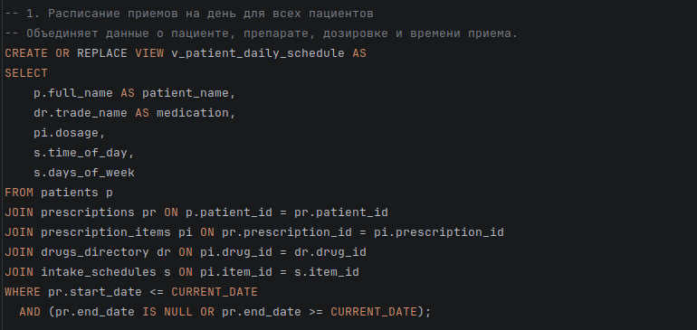

**Интерпретация:** Пациент Максим Кузнецов имеет 4 запланированных приема на сегодня: Метформин (10мг в 05:03) и Лозартан (20мг в разное время).

---

### Представление 2: `v_doctor_workload`

**Описание:** Аналитическое представление, показывающее загруженность каждого врача: количество уникальных пациентов и общее число выписанных назначений. Использует `LEFT JOIN` для отображения всех врачей, включая тех, у кого пока нет назначений.

**Код создания:**
```sql
CREATE OR REPLACE VIEW v_doctor_workload AS
SELECT
    d.specialization,
    d.doctor_id,
    COUNT(DISTINCT pr.patient_id) as unique_patients,
    COUNT(pr.prescription_id) as total_prescriptions
FROM doctors d
LEFT JOIN prescriptions pr ON d.doctor_id = pr.doctor_id
GROUP BY d.doctor_id, d.specialization;
```

**Тестовый вызов:**
```sql
SELECT * FROM v_doctor_workload LIMIT 5;
```

**Результат:**
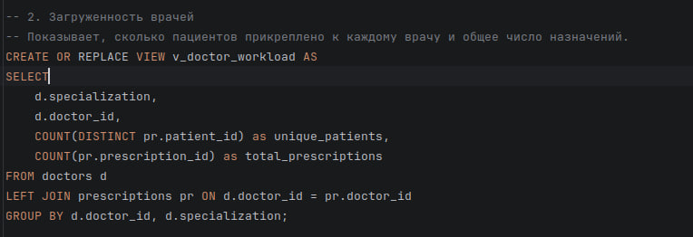

**Интерпретация:** В выборке представлены врачи разных специализаций с информацией о нагрузке. Например, Терапевт с ID `12cb9b76-...` обслуживает 4 уникальных пациентов и имеет 4 назначения.

---

## Заключение
В ходе работы была создана база данных с репрезентативным набором данных. Проведен анализ производительности, который подтвердил эффективность использования индексов для оптимизации JOIN-операций и фильтрации. Реализована серверная логика на языке PL/pgSQL (2 функции и 2 процедуры), а также 2 представления, объединяющих данные из нескольких таблиц. Все объекты протестированы на реальных данных из БД и показали корректные результаты.