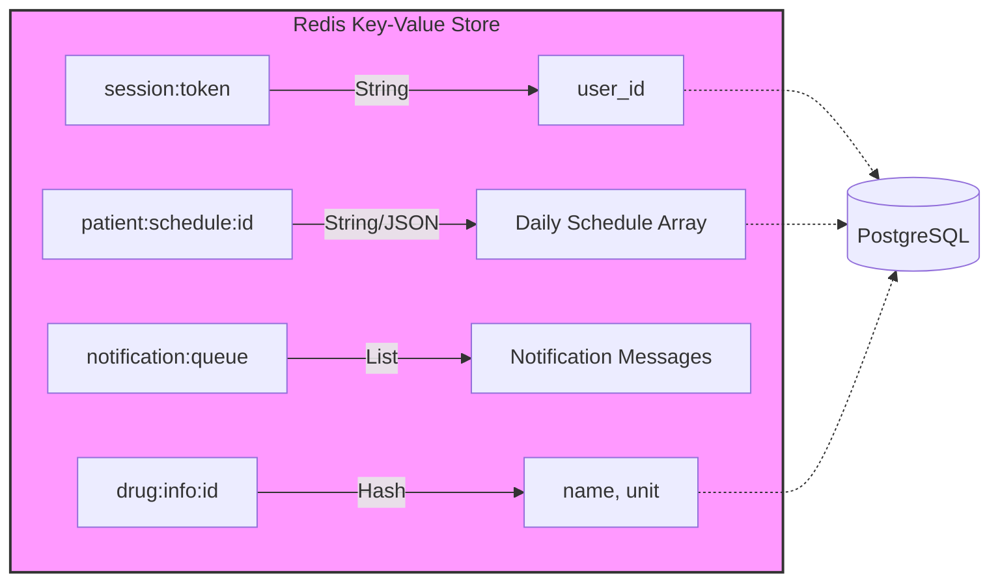

# Отчет по Лабораторной работе №3: Проектирование NoSQL базы данных (Redis)

## 1. Проектирование NoSQL БД
Для системы напоминаний о приеме препаратов была выбрана архитектура Polyglot Persistence. Основные структурированные данные хранятся в PostgreSQL, а для обеспечения высокой производительности, управления сессиями и кэширования используется NoSQL БД **Redis**.

### Описание хранимых данных (Redis)
Redis представляет собой хранилище типа «ключ-значение» (Key-Value). В отличие от реляционных БД, здесь данные организуются в виде различных типов структур (Strings, Hashes, Lists).

**Схема данных (Data Model):**

**Список используемых сущностей и структур:**

| Сущность (Ключ) | Тип данных Redis | Описание | Примеры атрибутов/значений |
| :--- | :--- | :--- | :--- |
| `session:{token}` | String | Данные активной сессии пользователя | `token` $\to$ `user_id` |
| `patient:schedule:{id}` | String (JSON) | Кэш расписания на сегодня для пациента | `id` $\to$ `[{"drug": "...", "time": "..."}]` |
| `notification:queue` | List | Очередь уведомлений, ожидающих отправки | Список сообщений: `"Reminder for..."` |
| `drug:info:{id}` | Hash | Быстрый справочник базовой информации о препарате | `name`, `unit` |

**Связи:**
Redis используется как вспомогательный слой. Связь с основной БД (PostgreSQL) осуществляется по уникальным идентификаторам (`user_id`, `patient_id`, `drug_id`), которые являются частью ключей в Redis.

## 2. Перечень основных операций с NoSQL БД
Операции в Redis оптимизированы для работы с оперативной памятью и имеют константную сложность $O(1)$ для большинства простых действий.

1. **Управление сессиями:**
   - `SET session:token user_id EX 3600` — создание сессии с временем жизни 1 час.
   - `GET session:token` — проверка авторизации пользователя.
2. **Кэширование расписания:**
   - `SET patient:schedule:id "JSON_DATA"` — сохранение сформированного расписания на день.
   - `GET patient:schedule:id` — мгновенная выдача графика при открытии приложения.
3. **Работа с очередью уведомлений:**
   - `LPUSH notification:queue "msg"` — добавление нового уведомления в очередь.
   - `RPOP notification:queue` — извлечение уведомления для отправки пользователю.
4. **Быстрый поиск препарата:**
   - `HGET drug:info:1 name` — получение названия препарата без обращения к диску PostgreSQL.

## 3. Выбор СУБД
**Выбранная СУБД:** Redis.
**Обоснование:** 
Redis был выбран как наиболее подходящий инструмент для реализации слоя кэширования и управления состоянием системы в реальном времени.
- **Скорость:** Хранение данных в RAM обеспечивает минимальные задержки (миллисекунды).
- **Типы данных:** Поддержка списков (Lists) идеально подходит для реализации очередей уведомлений.
- **TTL (Time To Live):** Возможность автоматического удаления сессий по истечении времени.

## 4. Установка и настройка
СУБД развернута с помощью Docker Compose.
- **Образ:** `redis:latest`
- **Порт:** `6379`
- **Средство работы:** DBeaver (с использованием Redis драйвера) или `redis-cli`.

## 5. Создание базы данных
В Redis понятие «базы данных» отличается от реляционных СУБД. Данные создаются динамически при первом обращении. Структура данных (ключи и типы) была спроектирована в соответствии с разделом 1 данного отчета.

## 6. Наполнение данными
База данных была наполнена тестовыми данными с помощью Bash-скрипта `lab3/seed_redis.sh`. 

**Примеры данных в системе:**
- Создано 4 активные сессии пользователей.
- Кэшировано расписание для 4 пациентов.
- В очередь уведомлений добавлено 5 сообщений.
- Созданы быстрые записи для 5 основных препаратов.

### Проверка данных:
Для проверки использовались команды `GET` и `LRANGE`.
(Скриншот результата вызова команд в DBeaver/CLI прилагается к отчету в виде отдельного приложения)
