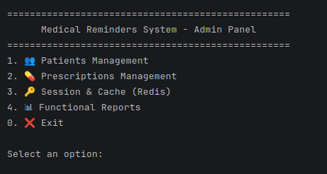
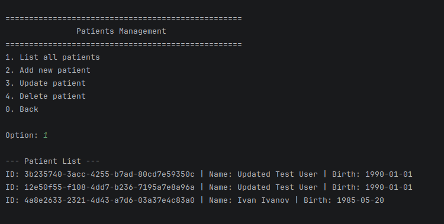
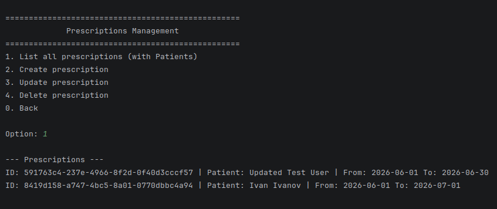
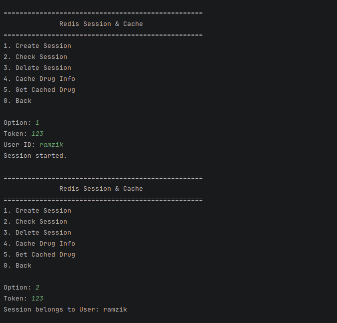
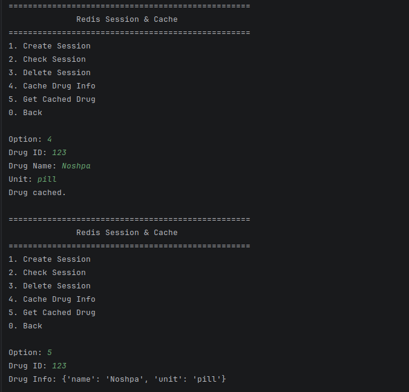
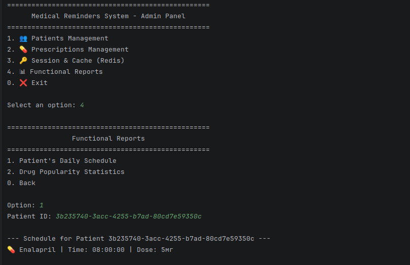
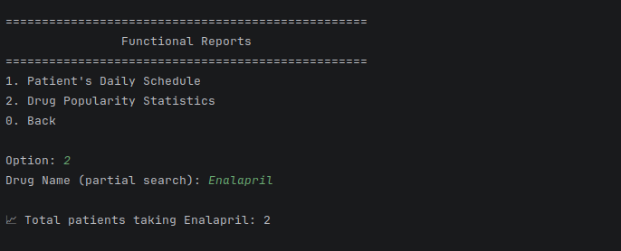
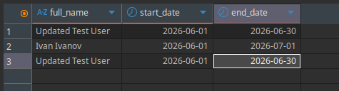

# Отчет по Лабораторной работе №4: Реализация приложения для работы с БД

## 1. Выбранный язык программирования
- **Язык:** Python 3.11
- **Обоснование:** Высокая скорость разработки, наличие мощных библиотек для работы с SQL и NoSQL базами данных, соответствие общему стеку проекта.

## 2. Используемые технологии и библиотеки
- **PostgreSQL:** Библиотека `psycopg2-binary` для обеспечения низкоуровневого подключения и выполнения SQL-запросов.
- **Redis:** Библиотека `redis` для взаимодействия с in-memory хранилищем через стандартный протокол Redis.
- **Архитектурный паттерн:** `Repository` (Репозиторий). Позволяет изолировать логику доступа к данным от бизнес-логики и интерфейса.

## 3. Описание структуры приложения
- **UI Layer (main.py):** Консольный интерфейс для взаимодействия с пользователем.
- **Service Layer (medical_service.py):** Обработка бизнес-логики и координация работы репозиториев.
- **Repository Layer (repositories.py):** Классы для выполнения конкретных запросов к PostgreSQL и Redis.
- **DB Connection (db_config.py):** Настройка параметров подключения.

## 4. Реализованный функционал и описание команд
### 4.1. Управление пациентами (Patients Management)
Команды:
- `1. List all patients`: Вывод списка всех пациентов из БД.
- `2. Add new patient`: Создание новой записи в таблице `patients`.
- `3. Update patient`: Изменение ФИО или даты рождения.
- `4. Delete patient`: Удаление пациента из системы.

### 4.2. Управление назначениями (Prescriptions Management)
Команды:
- `1. List all prescriptions`: Вывод всех назначений. Используется **SQL JOIN** для подстановки имени пациента вместо его UUID.
- `2. Create prescription`: Создание записи о назначении лечения.
- `3. Update prescription`: Изменение сроков действия назначения.
- `4. Delete prescription`: Удаление записи о назначении.

### 4.3. Работа с NoSQL (Redis)
Команды:
- `1. Create Session`: Создание временной сессии пользователя в Redis с TTL.
- `2. Check Session`: Проверка существования сессии по токену.
- `3. Delete Session`: Удаление сессии.
- `4. Cache Drug Info`: Сохранение базовой информации о препарате в Redis Hash.
- `5. Get Cached Drug`: Мгновенное получение данных о препарате из кэша.

### 4.4. Функциональные отчеты
Команды:
- `1. Patient's Daily Schedule`: Сложный запрос, который объединяет данные из 4-х таблиц PostgreSQL, чтобы вывести полный список лекарств, время приема и дозировку для конкретного пациента.
- `2. Drug Popularity Statistics`: Агрегационный запрос для подсчета количества уникальных пациентов, принимающих определенное лекарство.

## 5. Результаты тестирования
- Все функции CRUD протестированы с помощью автоматического скрипта `test_verify.py`.
- Связи между таблицами (Foreign Keys) соблюдаются: удаление пациента невозможно, если у него есть активные назначения (защита целостности).
- Redis работает в режиме Key-Value и Hash, обеспечивая мгновенный доступ к сессиям и кэшу.

## 6. Скриншоты работы приложения

### Главный экран
Запуск приложения и отображение главного меню навигации.

### CRUD Пациентов
Демонстрация вывода списка всех зарегистрированных пациентов в системе.

### JOIN Запросы
Список назначений, где реализован вывод имени пациента вместо его UUID (подтверждение работы JOIN).

### Сессии Redis
Создание активной сессии пользователя и её последующая проверка по токену.

### Кэш Redis
Пример сохранения базовой информации о препарате в Redis Hash и её мгновенного извлечения.

### Расписание пациента
Результат выполнения сложного функционального запроса по формированию дневного графика приема лекарств.

### Статистика по препарату
Результат работы агрегационного запроса по подсчету популярности конкретного лекарства среди пациентов.

### Верификация в БД
Подтверждение записи и изменения данных непосредственно в PostgreSQL через DBeaver.

## 7. Репозиторий
- Ссылка на исходный код: https://github.com/Ramzikkkk/medical-reminders-db.git
